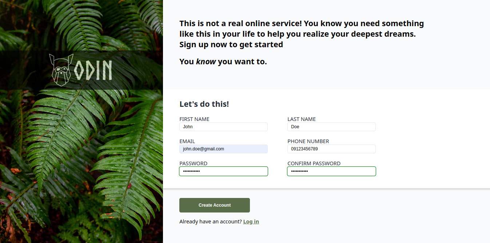

# Sign-up form
Implementing my knowledge with form controls and form validation by making a simple sign-up form

## Preview
Start toying with the sign-up form by clicking [this](https://neil-justin.github.io/sign-up-form/)

## Objectives
- Apply a simple client-side form validation to form controls
- Semantically structured the webpage

## Acknowledgements
- This project was made possible by [The Odin Project](theodinproject.com) — a community-supported, open-source website that teaches full-stack web development for free.
- Background image by [Halie West](https://unsplash.com/@haliewestphoto) on [Unsplash](https://unsplash.com/photos/25xggax4bSA)